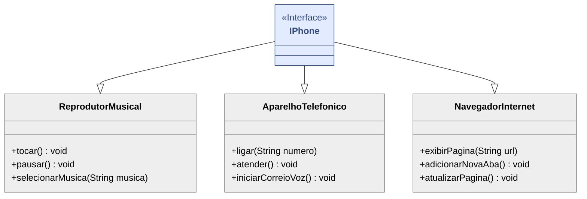

# 📲 Modelando Funções do Iphone

<h4 align="center"> 
    :construction:  Projeto em construção  :construction:
</h4>

	
Este pequeno projeto visa colocar em prática habilidades como análise de negócios, requisitos, pilares da programação orientada a objetos e modelagem UML. 
Desenvolvido durante a participação do Bootcamp Java Cloud na [Digital Innovation One](https://www.dio.me/).

## Proposta
- Utilizar uma ferramenta de UML para elaborar o diagrama das classes e interfaces, representando as funções do iPhone como Reprodutor Musical, Aparelho Telefônico e Navegador na Internet.
- Criar as classes, interfaces e métodos. Associando conforme seu relacionamentos, visibilidade e multiplicidade.
- Desenvolver o código, a fim de que o Iphone receba todas as funcionalidades.

## Modelo UML
Criado na platarfoma [Mermaid](https://mermaid.js.org/syntax/classDiagram.html)

